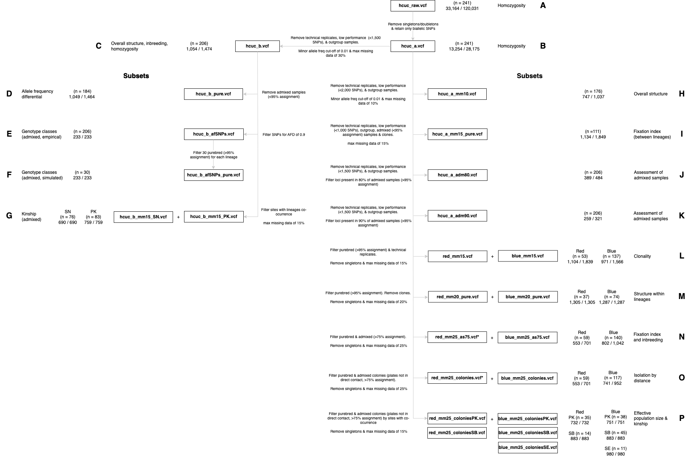

# **"Hybridization and inbreeding affect the survival of a critically endangered coral"**

Hernández-Agreda A, Huckeba J, Prata K, Vermeij MJA, Bongaerts P

Helioseris’ datasets. Description (filters applied, number of samples, and loci/SNPs) and purpose are indicated for each dataset.

Raw data: [PRJNA1135547](https://url.avanan.click/v2/___https://www.ncbi.nlm.nih.gov/sra/PRJNA1135547___.YXAzOmNhbGFjYWRlbXk6YTpnOjEzYjE4MDYxMWY1MWM5YzMyZjVhZDhmZGQ2ODQ4YTcxOjY6YjVmZjoxYzhmOGI5MThhZDNiMGE4NDJiMGMzZmQ4ZTk1NDYzZDM4OWVkMWVhZjBiZmZhMTU3MTljYjk2MmQ1NjYyODk2OnA6VDpO) 

(A) hcuc_raw.vcf